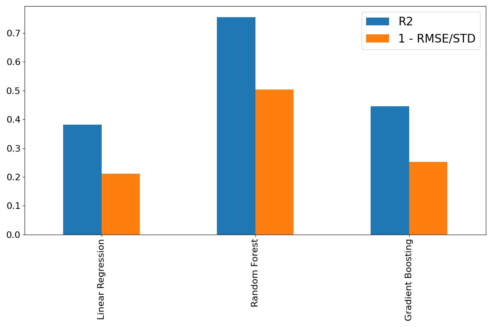
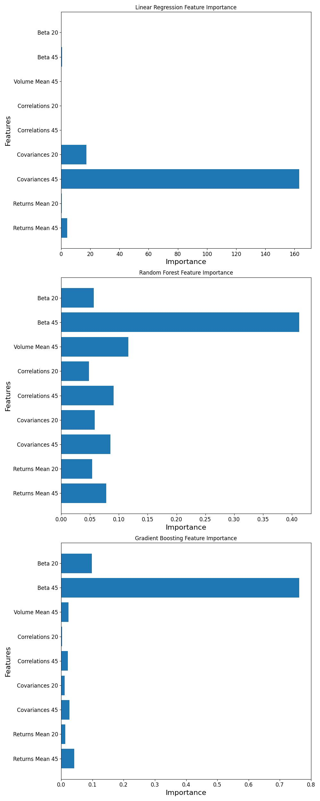

# Beta Prediction, Portfolio Optimization & Loan Default Prediction 

This repository contains three separate projects: 
1. **45-day Forward-looking Beta Prediction Model**: A robust 45-day forward-looking Beta prediction model with a **0.78 R2-Score**.
2. **Portfolio Optimization App**: An interactive Streamlit app for optimizing financial portfolios based on historical data. Find it [here](https://portfolio-optim.streamlit.app/).
3. **Loan Default Prediction**: A machine learning notebook that predicts loan defaults using the [Lending Club Loan Data](https://www.kaggle.com/datasets/adarshsng/lending-club-loan-data-csv/data) from Kaggle with a **98% accuracy**.

## Projects 

### 1. 45-day Forward-looking Beta Prediction Model

#### What is Beta in Finance?

Beta ($\beta$) is a measure of a stock's volatility relative to the overall market or a reference stock. It is often used to assess the risk of an investment compared to the broader market. A stock with a high beta is more volatile and thus riskier than the market, while a low-beta stock is less volatile.

Beta is defined as:

$$\beta = \frac{\text{Cov}(R_i, R_m)}{\text{Var}(R_m)}$$

Where:
- R_i: Return of the individual stock
- R_m: Return of the market index
- $\text{Cov}(R_i, R_m)$: Covariance between the stock's returns and the market's returns
- $\text{Var}(R_m)$: Variance of the market's returns

Interpretation of Beta

- **$\beta = 1$**: The stock's returns move in perfect correlation with the market. It has the same risk as the market.
- **$\beta > 1$**: The stock is more volatile than the market.
- **$\beta < 1$**: The stock is less volatile than the market.
- **$\beta < 0$**: Rare but possible, indicating the stock moves inversely to the market.

For more information, refer to [this link](https://www.investopedia.com/investing/beta-know-risk/).

#### The model
This notebook included a robust 45-day forward-looking Beta (the Beta calculated using data for the next 45 days) prediction model.

Objectives:

- Build a robust model that accurately predicts the 45-day forward-looking Beta for a given stock.
- Evaluate to a 'Baseline' model that predicts the average value of beta every time, we expect a significant improvement.
- Find relevant features to understand the factors predicting Beta.

Results:

- Best performing model: Random Forest Regressor. We calculated a RMSE of 0.27 and a r2-score of 0.78. For a target with an average of about 1 and a STD of 0.57, this represents an average difference of less than 30% to the real value and a 53% decrease compared to a 'Baseline' model that guesses the mean value everytime.The R2 score of 0.78 implies that 78% of the variance in the target variable is explained by this model, compared to 0% in the simple 'Baseline' model.
- After extracting the Feature Importances, the results show that for linear regression, the 45-day past Covariances are the most relevant feature by far. However, for the RF and GB Regressors the 45-day past Beta is the largest predictor of the 45-day future beta.




### 2. [Portfolio Optimization](https://portfolio-optim.streamlit.app/) App 
This project is a **Streamlit-based interactive app** that allows users to explore and optimize their investment portfolios. The app calculates the optimal distribution of stocks in a portfolio by maximizing the Sharpe ratio in a given time interval. It offers visualization tools to see how the portfolio's returns, volatilities, closing price, and daily returns compare to those of the individual stocks. The app is included in the file PToptimizer.py

#### Features 
- Interactive portfolio optimization using **Sharpe Ratio Maximization**
- Visualization of the portfolio's performance against individual stocks
- Ability to add any number of stock tickers
- Portfolio statistics (e.g., expected return, volatility, Sharpe ratio)


### 3. Loan Default Prediction 
This project consists of a **machine learning notebook** that predicts whether a loan will default or not using the [Lending Club Loan Data](https://www.kaggle.com/datasets/adarshsng/lending-club-loan-data-csv/data) from Kaggle. The notebook (Loan_def.ipynb) builds and compares the performance of four different classifiers: **Logistic Regression**, **Decision Trees**, **Random Forests**, and **XGBoost**. The random forest model performed the best with a **98% accuracy and f1-score** on the test data.

#### Features 
- Data preprocessing (e.g., handling missing values, encoding categorical features)
- Exploratory Data Analysis
- Model training and evaluation using:
- Logistic Regression
- Decision Trees
- Random Forests
- XGBoost Classifier
- **98% accuracy and f1-score** on predicting loan defaults
- Feature Importance Estimation


## Installation 
To run these projects locally: 
1. Clone the repository: ```bash git clone https://github.com/albertonavaa/Selected-Projects.git cd your-repo ```
2. Install the required dependencies: ```bash pip install -r requirements.txt ```
3. Open the notebook or
4. Run the streamlit app: ```bash streamlit run PToptimizer.py ```

## License 
This project is licensed under the MIT License - see the License file for details. 

