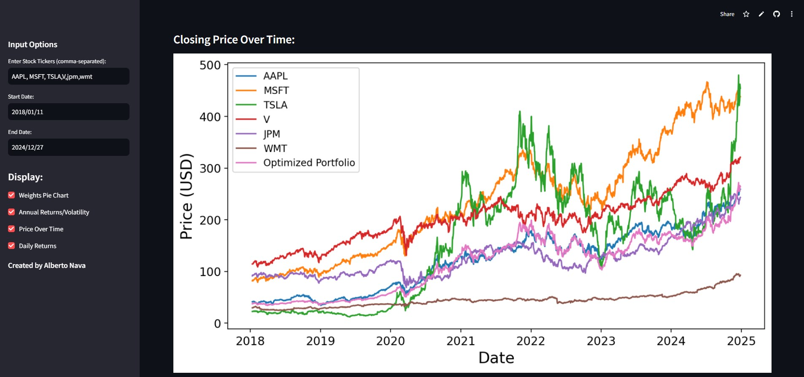

# Portfolio Optimization & Loan Default Prediction 

This repository contains two separate projects: 
1. **Portfolio Optimization App**: An interactive Streamlit app for optimizing financial portfolios based on historical data. Find it [here](https://portfolio-optim.streamlit.app/).
2. **Loan Default Prediction**: A machine learning notebook that predicts loan defaults using the [Lending ClubLoan Data](https://www.kaggle.com/datasets/adarshsng/lending-club-loan-data-csv/data) from Kaggle with a *98% accuracy*.

## Projects 

### 1. [Portfolio Optimization](https://portfolio-optim.streamlit.app/) App 
This project is a **Streamlit-based interactive app** that allows users to explore and optimize their investment portfolios. The app calculates the optimal distribution of stocks in a portfolio by maximizing the Sharpe ratio in a given time interval. It offers visualization tools to see how the portfolio's returns, volatilities, closing price, and daily returns compare to those of the individual stocks.

#### Features 
- Interactive portfolio optimization using **Sharpe Ratio Maximization**
- Visualization of the portfolio's performance against individual stocks
- Ability to add any number of stock tickers
- Portfolio statistics (e.g., expected return, volatility, Sharpe ratio)



### 2. Loan Default Prediction 
This project is a **machine learning notebook** that predicts whether a loan will default or not using a Kaggle dataset. It builds and compares the performance of four different classifiers: **Logistic Regression**, **Decision Trees**, **Random Forests**, and **XGBoost**. The random forest model performed the best with a **98% accuracy and f1-score** on the test data. 

#### Features 
- Data preprocessing (e.g., handling missing values, encoding categorical features)
- Model training and evaluation using:
- Logistic Regression
- Decision Trees
- Random Forests
- XGBoost Classifier
- **98% accuracy and f1-score** on predicting loan defaults

#### Installation 
To run these projects locally: 
1. Clone the repository: ```bash git clone https://github.com/albertonavaa/Selected-Projects.git cd your-repo ```
2. Install the required dependencies: ```bash pip install -r requirements.txt ```
3. You can run the streamlit app: ```bash streamlit run PToptimizer.py ```

## License 
This project is licensed under the MIT License - see the License file for details. 

